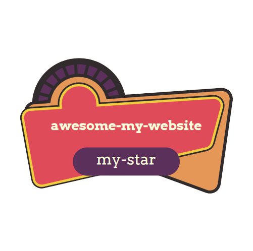
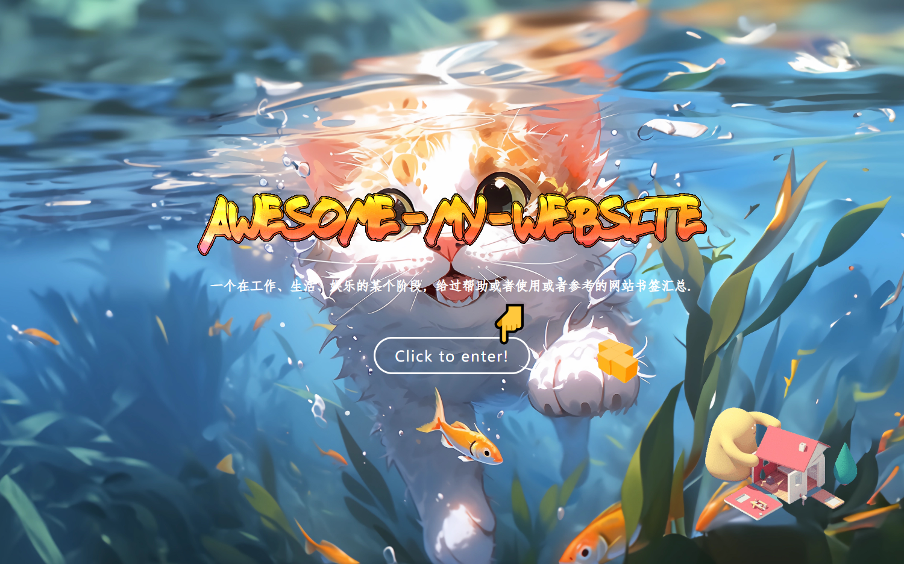
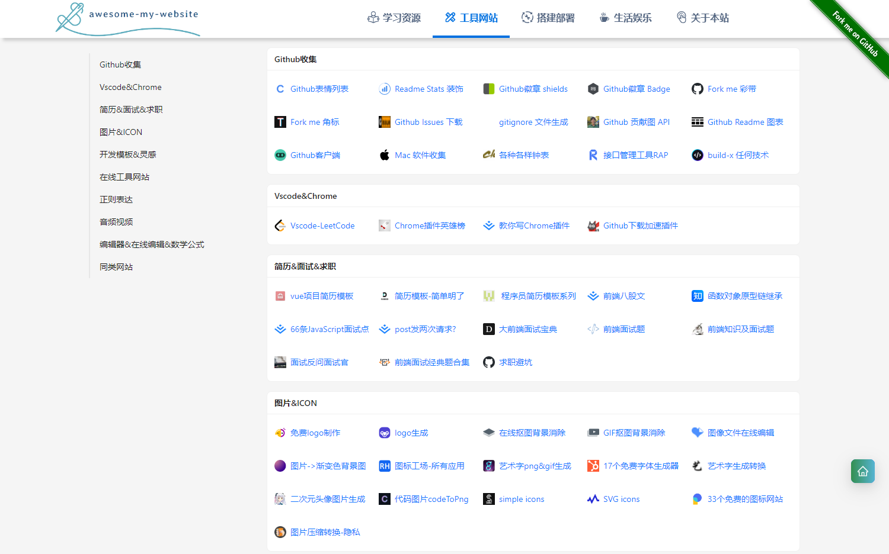
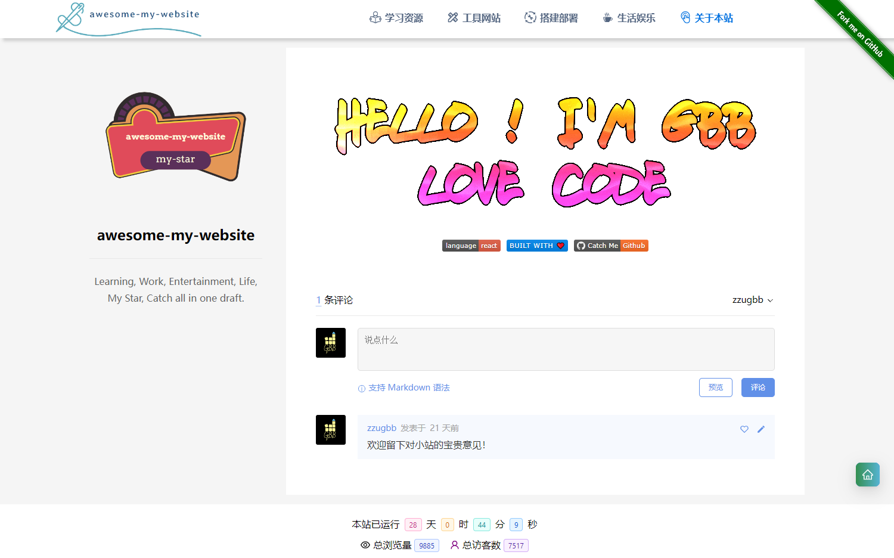

<p align="center">
 
 <h2 align="center">awesome-my-website</h2>
 <p align="center">Learning, Work, Entertainment, Life, My Star, Catch all in one draft.</p>
</p>

<p align="center">
 
 
 
</p>

### Overview :clap:



</br>
</br>

</br>
</br>



### Quick start :point_down:

```sh
yarn install
yarn start
```

> :point_right: Then open http://localhost:3000/ to see your website.

### Deploy to gh-pages :muscle:

```sh
npm run deploy -- -m "commit msg"
```

### Link :link:

* :pager: [Deployment GitHub Pages](https://create-react-app.bootcss.com/docs/deployment#github-pages)
* :sunflower: [busuanzi](https://busuanzi.ibruce.info/)
