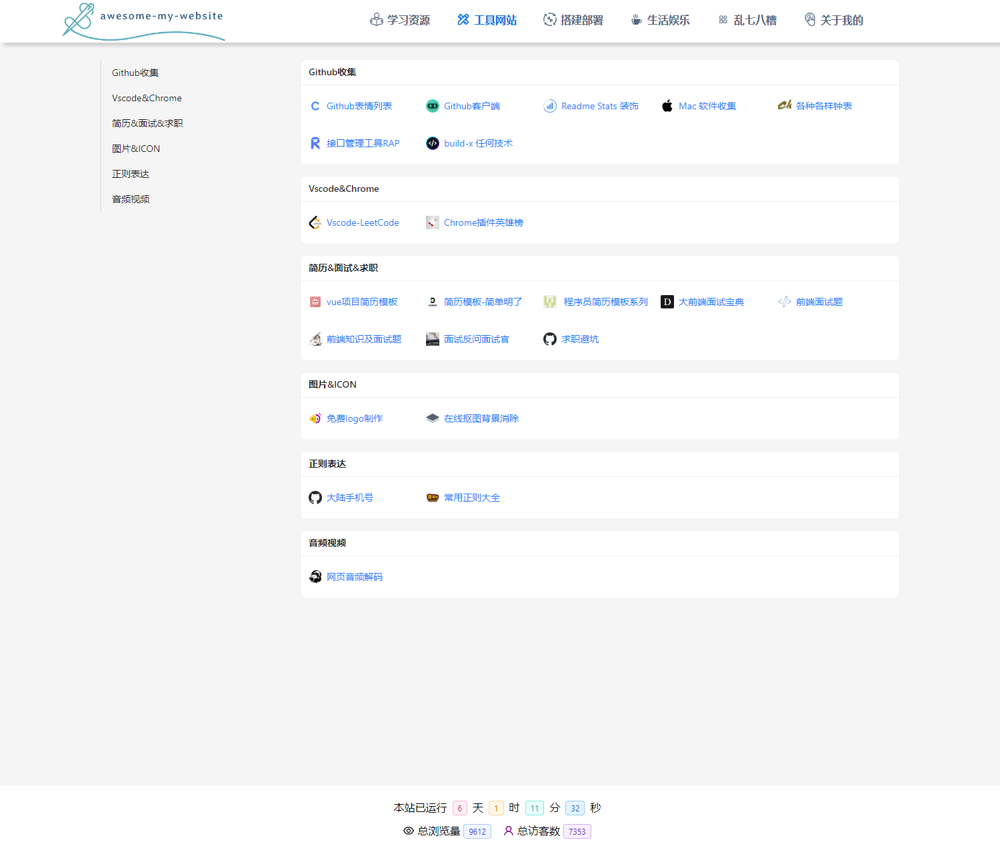

<p align="center">
 
 <h2 align="center">awesome-my-website</h2>
 <p align="center">Learning, Work, Entertainment, Life, My Star, Catch all in one draft.</p>
</p>

<p align="center">
 
 
 
</p>

### Overview

<p align="center">
 
</p>

### Quick start

```sh
yarn install
yarn start
```

Then open http://localhost:3000/ to see your website.

### Deploy to gh-pages

```sh
npm run deploy -- -m "commit msg"
```
